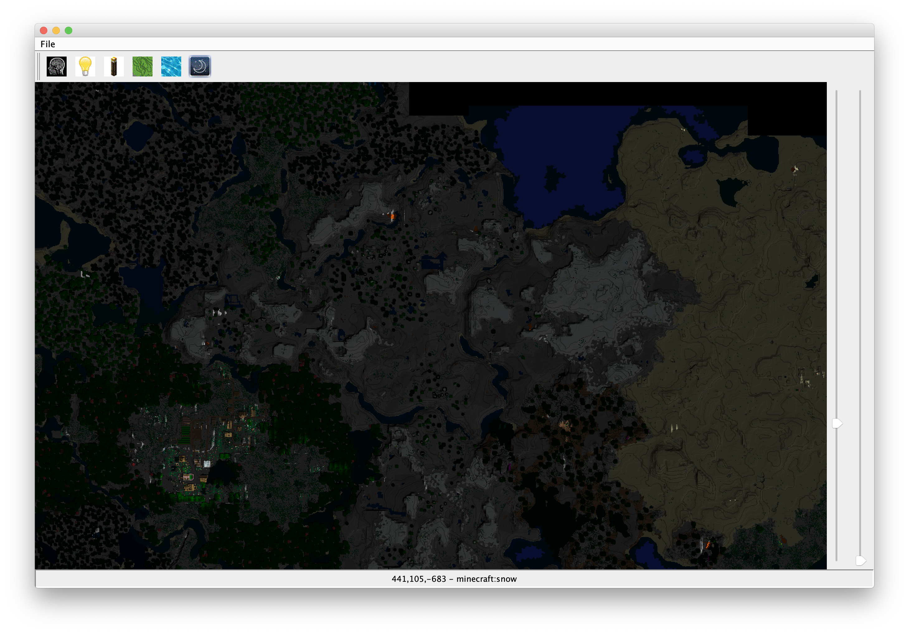

# A CT Scanner for Minecraft Worlds

I wrote this for my kids who wanted a mapper that was responsive, could do X-Rays of worlds and supported Minecraft 1.14. It's fairly crude, but gets the job done.

To open a world, navigate to the world directory and select (but don't navigate into) the ```region``` folder.

There are several modes. The right hand slider lets you change the scale. To pan, drag the image with the mouse. It may be a bit sluggish at first before the chunk cache is loaded.

## How to run
```
gradle shadowJar
java -jar build/libs/minect-0.1.0-all.jar
```

If anyone ends up being remotely interested in this tool, I will provide a compiled JAR as well.

### Normal mode. Just a map.
You can turn elevaion curves on and off.


### Dry mode
Removes all the water so you can view the sea floor.


### Night mode
Highlights lit areas.


### CT Scan mode
Shows a specific layer of the map. Travel up and down using the left hand slider. Super useful for finding underground structures, such as mine shafts and strongholds.


## Known issues
* Some block types aren't defined yet
* Could use some feedback, like an hourglass or spinner when loading

## Contributing
I hope you enjoy this simple tool. If not, feel free to make it better and file a PR!


